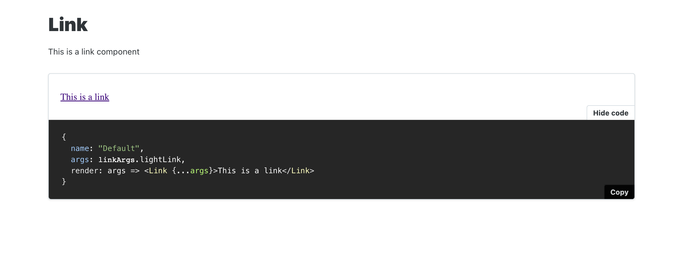

# storybook-csf3-repro

This reproduces an issue rendering Source code for React components using CSF3 story format and stand-alone doc files.

To see the issue, install dependencies, run storybook and check the Docs of the Link component.

## Install

`bash
pnpm install
`

## Run

`pnpm storybook`

## Description of the issue

Right now in the standalone Doc for this component, we see the CSF3 from the story.



Instead, we should see the JSX markup:

```jsx
<Link theme="light" url="https://www.ilo.org" className="some-class">
  This is a link
</Link>
```
